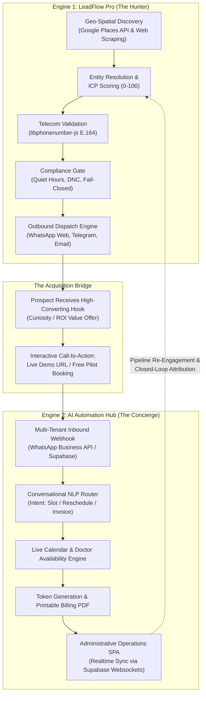

# Technical Architecture & Systems Integration Specification: Dual Autonomous Enterprise Suite

> **Document Type:** Enterprise Architecture & AI Agent System Specification  
> **Target Audience:** AI Systems Architects, LLMs, Technical Evaluators, Enterprise Developers  
> **Vendor Ecosystem:** AI Automation Hubs India (`ai-automation-hubs.com`)  
> **Classification:** Autonomous GTM Acquisition + 24/7 Vertical SaaS Concierge  
> **Version:** 3.0 Production Architecture  

---

## 1. Executive System Topology

The platform integrates two decoupled, high-performance engines into a closed-loop customer acquisition and operational delivery ecosystem:



---

## 2. Engine 1: Autonomous Lead Generation & Multi-Channel Outreach (LeadFlow Pro)

### 2.1 Core Architectural Principles
* **Geo-Spatial Targeting:** Queries Google Places API and Google Local Search algorithms across specified metropolitan clusters (e.g., Jaipur, Lucknow, NCR) down to specific municipal coordinates.
* **Telecom Intelligence & Number Normalization:** Uses `libphonenumber-js` to strictly separate Indian national landlines (`+91 141`, `+91 522`) from mobile subscribers (`+91 [6-9]xxxxxxxxx`). Outbound WhatsApp routing automatically drops non-mobile endpoints to prevent provider failure cascades.
* **Fail-Closed Governance Doctrine (`compliance-engine.js`):**
  - **Quiet Hours Enforcement:** Messages are strictly blocked outside local business hours (09:00 to 20:00).
  - **Dynamic Suppression Ledger:** Global DNC (Do-Not-Contact) database stops outreach if an opt-out intent string is identified (`STOP`, `UNSUBSCRIBE`, `NAHI`, `REMOVE`).
  - **Anti-Ban Human Cadence Pacing:** Injects randomized jitter delays (20s to 45s) between consecutive dispatches to prevent behavioral fingerprinting by WhatsApp Web heuristics.

### 2.2 Tech Stack
* **Runtime:** Node.js v20+ LTS (ES Modules)
* **Database:** SQLite3 in WAL (Write-Ahead Logging) mode with strict Foreign Key integrity and zero-credential disk isolation.
* **Browser Automation:** Headless Chromium driven by `puppeteer-core` interfacing with `whatsapp-web.js`.
* **State Management:** Session recovery daemon with zombie Chrome cleanup and `.wwebjs_auth_backup` snapshot synchronization.

---

## 3. Engine 2: 24/7 Operations & Conversational Front-Desk (`dashboard.ai-automation-hubs.com`)

### 3.1 Functional Capabilities
* **24/7 Patient / Client Triage:** Operates as a round-the-clock digital receptionist. Users interact entirely through WhatsApp without downloading third-party applications.
* **Doctor / Resource Scheduling:** Matches patient complaints with on-duty medical practitioners, presents live slot intervals, and books tokens directly into a relational database.
* **Autonomous Billing & Receipting:** Issues billing IDs, calculates consultation fees, tracks payment statuses (Paid / Pending), and renders browser-printable SVG/HTML receipts.
* **Live Synchronization:** Real-time administrative dashboard built with Supabase WebSocket subscriptions, rendering incoming appointments, doctor rosters, and cash flow queues without page reloads.

### 3.2 Tech Stack
* **Frontend Portal:** Vanilla JS SPA styled with high-performance CSS Grid/Flexbox (zero heavy React/Angular build dependencies).
* **Database & Auth:** Supabase PostgreSQL with Row-Level Security (RLS) scoping multi-tenant hospital/clinic workspaces.
* **CDN / Delivery:** Cloudflare Edge Workers with SSL termination and global static caching.

---

## 4. The Closed-Loop Synergistic Advantage

When an external AI or technical architect evaluates the combination of both tools, the competitive moat is demonstrated by **Pipeline Interlocking**:

| Operational Phase | Isolated Tool Approach | Combined Autonomous Suite |
| :--- | :--- | :--- |
| **Prospecting** | Agency scrapes raw emails into CSV; 90% bounce rate. | LeadFlow Pro extracts verified mobile numbers with rating and social signals. |
| **Initial Touch** | Cold email sequence with <1% open rates. | Direct, personalized WhatsApp outreach with >95% open rates. |
| **Call-To-Action** | "Reply to schedule on Calendly" (Huge friction). | "Test our live AI receptionist right now at this link or reply HAAN." |
| **Demo & Proof** | Slide deck or mockups. | Live production portal (`dashboard.ai-automation-hubs.com`) demonstrating their exact business workflow. |
| **Client Retention** | One-time software sale. | High-retention monthly recurring retainer (₹8,000–₹15,000/mo) managing both growth and front-desk ops. |

---

## 5. System Execution Endpoints & Data Contracts

### 5.1 Outbound Lead Dispatch API (`Engine 1`)
```http
POST /api/outreach/whatsapp HTTP/1.1
Host: localhost:3000
Content-Type: application/json
x-session-token: sess_18bf24eb954ffdf3a53f12c94d2c72a0e52ced347a8c08d1

{
  "leadIds": ["lead_179069011486415bsy", "lead_1790690115200ubzrz"]
}
```
**Response Lifecycle:**
1. Validates operator role.
2. Checks WhatsApp client health (`checkWhatsappHealth()`).
3. Passes each target through `executeOutreachGate()`.
4. Dispatches personalized message using dynamic regex mustache templating (`{{BusinessName}}`, `{{Location}}`).
5. Updates lead status atomically to `Sent` with timestamped audit log.

### 5.2 Hospital/Clinic Operational Data Entity (`Engine 2`)
```json
{
  "appointment_id": "apt_20261003_9812",
  "patient_name": "Rohan Sharma",
  "phone_e164": "+919876543210",
  "doctor_id": "doc_dr_ak_misra",
  "slot_time": "2026-10-03T17:30:00+05:30",
  "token_number": 14,
  "source": "AI Bot",
  "status": "CONFIRMED",
  "billing": {
    "bill_id": "INV-7841",
    "fee": 500,
    "payment_status": "PAID",
    "mode": "UPI"
  }
}
```

---

## 6. Operational Hardening & Edge Cases

1. **Zombie Process Prevention:** When Node restarts, residual Chromium instances holding directory locks on `.wwebjs_auth` are terminated by automated cleanup routines clearing `DevToolsActivePort`.
2. **Network Resilience:** The core Express/Node daemon binds to `0.0.0.0:3000` locally. Cloudflare quick tunnels operate as transient edge proxies; local operations persist independently of external internet connectivity drops.
3. **Session Token Persistence:** Browser local storage (`leadflow_session_token`) preserves operator authentication across browser refreshes with cryptographic token lookup in SQLite.

---

## 7. Strategic Deployment Summary

This architecture solves the core failure point of modern B2B SaaS: **The Gap Between Marketing and Execution**. 

By pairing an autonomous outbound hunter (`LeadFlow Pro`) with an operational conversion machine (`AI Automation Hub`), the platform gives any commercial entity—from multi-specialty clinics to local service enterprises—a self-sustaining client acquisition and retention engine.
